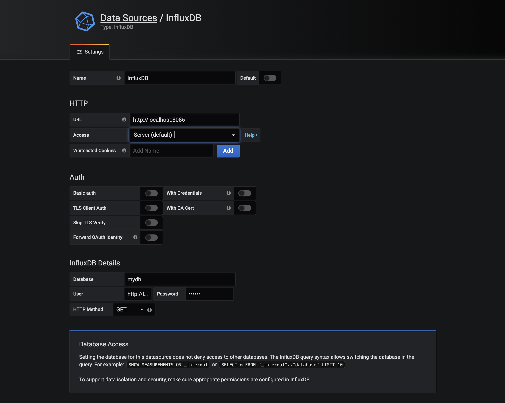
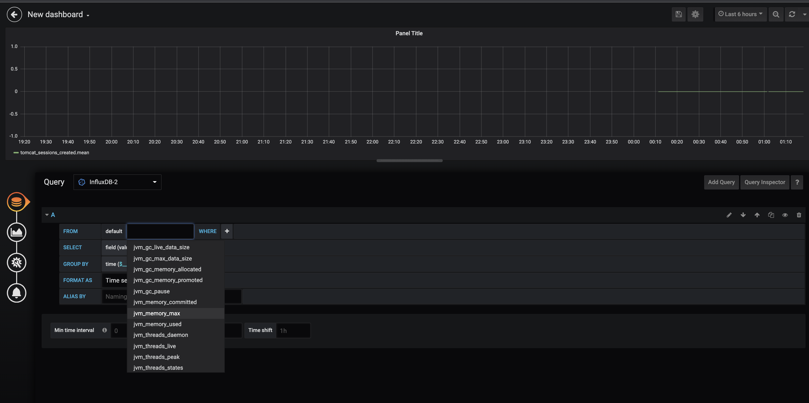

# Metrics med Spring Boot, Micrometer, InfluxDB og Grafana 

I denne øvingen skal dere bli kjent med hvordan man instrumenterer en Spring Boot applikasjon med Metrics. Vi skal bruke rammeverket 
Micrometer som er integrert i Spring Boot. Vi skal også se på  tidsseriedatabasen influxDB, og hvordan vi kan bruke Grafana for visualisering 

Koden i dette repositoriet eksponerer et undepunkt på http://localhost:8080/account - se på koden hvordan payload
strukturen er definert og HTTP metodene som brukes. Prøv APIet via Postman.

Applikasjonen er allerede konfigurert for å levere metrics til InfluxDB. Fordi denne avhengigheten er definert 
i prosjektet sin ```pom.xml``` 

```xml
<dependency>
    <groupId>io.micrometer</groupId>
    <artifactId>micrometer-registry-influx</artifactId>
    <version>1.5.5</version>
</dependency>
```

## Start influxDB

Før du starter Maven applikasjonen må InfluxDB kjøre. Det gjøres på følgende måte.

1. Kopier en influxdb.conf til ditt lokale filsystem
```sh
docker run --rm influxdb:1.0 influxd config > influxdb.conf
```

Dette kan være greit dersom vi ønsker å endre noe. Vi vil sende filen tilbake til containeren og overskrive med våre verdier
når vi kjører influx

2. Vi kan nå starte influx med følgende docker kommando. Legg merke til av vi overstyrer konfigurasjonsfilen
```
docker run -d --name influxdb \
  -p 8083:8083 -p 8086:8086 -p 25826:25826/udp \
  -v $PWD/influxdb:/var/lib/influxdb \
  -v $PWD/influxdb.conf:/etc/influxdb/influxdb.conf:ro \
  -v $PWD/types.db:/usr/share/collectd/types.db:ro \
  influxdb:1.0
````

Hvis dere nå går til http://localhost:8083/ får dere opp et enkelt brukergrensesnitt.

## Start Spring Boot appen

* Spring vil levere en god del metrics til Influx DB, blant annet fra JVM, Spring Boot Actutor, Spring web mm. 
* Test grensesnittet i applikasjkonen med Postman 

## Sjekk at det kommer data i influx

* Gå til http://localhost:8083/
* Bytt "database" til mydb
* I feltet for spørringer skriv "show measurements" for å se hva slags data som blir levert.
* Du kan også prøve å skrive for eksempel ```SELECT * FROM jvm_memory_used WHERE time > now() - 2h``` for å få se data om minnebruk
* Dokumentasjon på spørrespråket; - https://docs.influxdata.com/influxdb/v1.8/query_language/


## Instrumenter Spring Boot applikasjonen din med MicroMeter & custom metrics

Vi må sette inn noen målepunkter i koden så vi får metrics inn i InfluxDB som vi senere kan visualisere.
For eksempel

```java 
@PostMapping(path = "/tx", consumes = "application/json", produces = "application/json")
    public void addMember(@RequestBody Transaction tx) {
        meterRegistry.counter("currencycount", , tx.getCurrency()).increment();
    }
}
```

## Bonusoppgave 

Installer last-test verktøyet K6 på maskinen din og kjør en liten load test mot applikasjonen. Fra ```k&/``` katalogen i dette repositoryet kan du kjøre kommandoen 
```shell
 k6 run --vus 10 --duration 30s --out cloud simpleloadtest.js
```
s
## Visualisering av Metrics med Grafana

Start Grafana med docker 

```sh
docker run -d -p 3000:3000 --name grafana grafana/grafana:6.5.0
```

hvis dere går til <http://localhost:3000/> får dere opp et enkelt brukergrensesnitt. 


* Default brukernavn og passord er ``admin``.  
* Dere må bytte passord første gang dere logger på
* Velg "tannhjulet" på venstremenyen og Datasources.
* Lag en ny Datasource for InfluxDB


* I URL skriver dere inn http://host.docker.internal:8086
* I Database feltet skriver dere _mydb_
* Alle andre felter skal være urøret



* velg "Save & test". det skal komme opp en grønn melding som sier "Data source is working"

Sjekk at du kan lage et Dashbord og at det er noe data du kan ta utgangspunkt i. Vi rekker ikke dypdykke i 
grafana i denne labben. Hovedformålet er å bli kjent med Rammeverket Micrometer. 

Det ligger en demo av konfigurasjon og oppsett av en datakilde og dashboard i grafana her;
https://kristiania.instructure.com/courses/6805/files/folder/demo



Oppgave;

- Prøv ulike typer metrikker (Distribution summary, Counter, Gauge, Timer etc) - Sjekk dokumentasjonen - 
- Bruk gjerne følgende guide som inspirasjon https://www.baeldung.com/micrometer
- Referanseimplementasjon; https://micrometer.io/docs/concepts
- 
Nyttig informasjon; 

- https://spring.io/blog/2018/03/16/micrometer-spring-boot-2-s-new-application-metrics-collector
- https://docs.spring.io/spring-boot/docs/current/reference/htmlsingle/#production-ready-metrics
